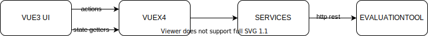

# evaluation tool admin frontend

## dev

-   yarn install
-   cp .env.local.example .env.local
-   yarn dev

## architecture

## routes

/surveys
/surveys/new
/surveys/:surveyId
/surveys/:surveyId/edit
/surveys/:surveyId/results

/survey-steps
/survey-steps/new (?)
/survey-steps/:surveyStepId

/survey-elements
/survey-elements/new
/survey-elements/:surveyElementId

/survey-step-results
/survey-step-results/new (?)
/survey-step-results/:surveyStepResultId
/survey-step-results/:surveyStepResultId/assets (?)

/languages
/languages/new
/languages/:languageId
/languages/:languageId/edit

/localizations
/localizations/new (?)
/localizations/:localizationId

/users/register
/users/login
/users/:userId/logout
/users/:userId/settings (?)
